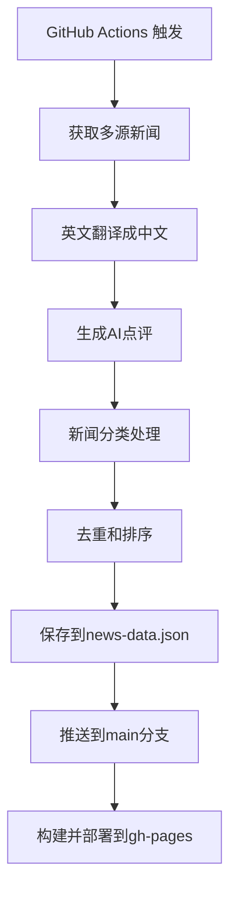
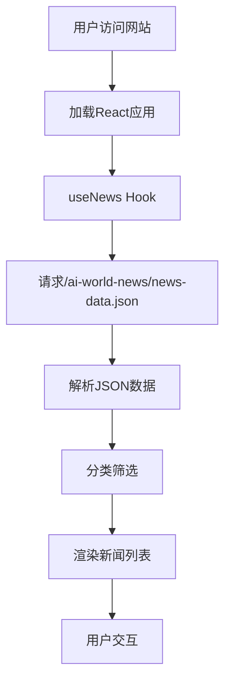

# AI 世界新闻项目说明文档

## 📋 项目概述

### 项目基本信息
- **项目名称**: AI World News (AI 世界新闻)
- **项目类型**: React + TypeScript 新闻聚合网站
- **部署方式**: GitHub Pages 静态部署
- **自动化**: GitHub Actions 定时获取新闻
- **原始框架**: Lovable 平台构建
- **改造目标**: 独立运行的静态新闻网站

### 技术栈
- **前端框架**: React 18.3.1
- **开发语言**: TypeScript 5.5.3
- **构建工具**: Vite 5.4.1
- **UI组件库**: shadcn/ui + Radix UI
- **样式方案**: Tailwind CSS 3.4.11
- **路由管理**: React Router DOM 6.26.2
- **状态管理**: React Query 5.56.2
- **部署平台**: GitHub Pages
- **CI/CD**: GitHub Actions

## 🎯 项目功能

### 核心功能
1. **多源新闻聚合** - 整合4个主要AI新闻源
2. **智能翻译** - 英文新闻自动翻译成中文
3. **AI点评** - 为每条新闻生成深度分析
4. **分类展示** - 按AI模型、科技、经济、深度分析分类
5. **自动更新** - 每小时自动获取最新新闻
6. **响应式设计** - 支持桌面和移动设备

### 新闻源配置
| 新闻源 | API | 配额 | 用途 |
|--------|-----|------|------|
| NewsAPI | NEWS_API_KEY | 1000次/天 | 主要新闻源 |
| NewsData | NEWSDATA_API_KEY | 200次/天 | 备用新闻源 |
| GNews | GNEWS_API_KEY | 100次/天 | 补充新闻源 |
| Currents | CURRENTS_API_KEY | 600次/天 | 额外新闻源 |

### AI服务配置
| 服务 | API密钥 | 用途 | 备注 |
|------|---------|------|------|
| 硅基流动 | SILICONFLOW_API_KEY | 翻译+AI点评 | 主要AI服务 |
| 腾讯翻译 | TENCENT_SECRET_ID/KEY | 备用翻译 | 可选配置 |

## 📁 项目结构

```
ai-world-news/
├── .github/workflows/          # GitHub Actions工作流
│   └── fetch-news.yml         # 自动新闻获取工作流
├── public/                    # 静态资源
│   ├── news-data.json        # 新闻数据文件
│   ├── 404.html              # SPA路由处理
│   ├── favicon.ico           # 网站图标
│   └── assets/               # 图片资源
├── scripts/                  # 自动化脚本
│   └── fetch-news.js        # 新闻获取脚本
├── src/                     # 源代码
│   ├── components/          # React组件
│   │   ├── ui/             # shadcn/ui组件
│   │   ├── AppHeader.tsx   # 应用头部
│   │   ├── CategoryTabs.tsx # 分类标签
│   │   ├── NewsCard.tsx    # 新闻卡片
│   │   └── NewsDetail.tsx  # 新闻详情
│   ├── hooks/              # React Hooks
│   │   └── useNews.ts      # 新闻数据钩子
│   ├── pages/              # 页面组件
│   │   ├── Index.tsx       # 首页
│   │   └── NotFound.tsx    # 404页面
│   ├── types/              # TypeScript类型
│   │   └── news.ts         # 新闻类型定义
│   ├── lib/                # 工具库
│   │   └── utils.ts        # 通用工具函数
│   ├── App.tsx             # 主应用组件
│   └── main.tsx            # 应用入口
├── package.json            # 项目依赖
├── vite.config.ts         # Vite配置
├── tailwind.config.ts     # Tailwind配置
├── tsconfig.json          # TypeScript配置
└── README.md              # 项目说明
```

## 🔧 开发环境配置

### 环境要求
- Node.js >= 18.0.0
- npm >= 9.0.0
- Git >= 2.30.0

### 本地开发
```bash
# 1. 克隆项目
git clone https://github.com/velist/ai-world-news.git
cd ai-world-news

# 2. 安装依赖
npm install

# 3. 配置环境变量
cp .env.example .env
# 编辑.env文件，添加API密钥

# 4. 启动开发服务器
npm run dev

# 5. 手动获取新闻数据（可选）
npm run fetch-news

# 6. 构建生产版本
npm run build

# 7. 预览生产版本
npm run preview
```

### 环境变量配置
创建 `.env` 文件：
```env
# 新闻API（至少配置一个）
NEWS_API_KEY=your_news_api_key
NEWSDATA_API_KEY=your_newsdata_api_key
GNEWS_API_KEY=your_gnews_api_key
CURRENTS_API_KEY=your_currents_api_key

# AI服务（必需）
SILICONFLOW_API_KEY=your_siliconflow_api_key

# 腾讯翻译（可选）
TENCENT_SECRET_ID=your_tencent_id
TENCENT_SECRET_KEY=your_tencent_key
```

## 🚀 部署配置

### GitHub Secrets配置
在GitHub仓库 Settings → Secrets and variables → Actions 中添加：

| 密钥名称 | 必需性 | 说明 |
|---------|--------|------|
| SILICONFLOW_API_KEY | ✅必需 | 硅基流动API密钥 |
| NEWS_API_KEY | 📋可选 | NewsAPI密钥 |
| NEWSDATA_API_KEY | 📋可选 | NewsData密钥 |
| GNEWS_API_KEY | 📋可选 | GNews API密钥 |
| CURRENTS_API_KEY | 📋可选 | Currents API密钥 |
| TENCENT_SECRET_ID | 📋可选 | 腾讯云翻译ID |
| TENCENT_SECRET_KEY | 📋可选 | 腾讯云翻译密钥 |

### GitHub Pages配置
1. 进入仓库 Settings → Pages
2. Source 选择 "Deploy from a branch"
3. Branch 选择 `gh-pages`，目录选择 `/ (root)`
4. 点击 Save

### GitHub Actions权限
确保仓库具有以下权限：
- Settings → Actions → General → Workflow permissions
- 选择 "Read and write permissions"
- 勾选 "Allow GitHub Actions to create and approve pull requests"

## 🤖 自动化工作流

### 工作流配置
文件位置: `.github/workflows/fetch-news.yml`

### 运行时机
- **定时执行**: 每小时运行一次 (cron: '0 * * * *')
- **手动触发**: Actions页面可手动执行
- **代码推送**: 仅在需要时手动触发

### 工作流步骤
1. **检出代码** - 获取最新源代码
2. **设置Node.js** - 配置运行环境
3. **安装依赖** - 安装npm包
4. **获取新闻数据** - 调用新闻API并处理
5. **构建项目** - 生成生产版本
6. **提交数据** - 推送新闻数据到main分支
7. **部署网站** - 部署到gh-pages分支

### 冲突处理机制
- 自动检测远程更改
- 智能rebase解决冲突
- 最多重试3次推送
- 失败时记录详细日志

## 📊 数据流程

### 新闻获取流程


### 前端数据流程


## 🛠️ 修复记录

### 2025-08-03 项目改造记录

#### 1. 初始问题分析
**问题**: 原项目依赖Supabase Edge Functions，无法在GitHub Pages独立运行

**解决方案**: 采用GitHub Actions + 静态JSON的架构

#### 2. 架构改造 (commit: 2a7cd8c)
**修改内容**:
- 创建GitHub Actions工作流 `.github/workflows/fetch-news.yml`
- 创建新闻获取脚本 `scripts/fetch-news.js`
- 修改前端Hook `src/hooks/useNews.ts` 支持静态JSON
- 配置Vite构建适配GitHub Pages
- 更新README部署指南

**技术细节**:
- 移除Supabase依赖
- 实现多源新闻API聚合
- 集成硅基流动AI翻译和点评
- 配置GitHub Pages基础路径

#### 3. 权限问题修复 (commit: e69e672)
**问题**: GitHub Actions推送被拒绝，.gitignore冲突

**修复内容**:
- 移除Actions中对dist/目录的提交
- 优化工作流只提交news-data.json
- 修复权限配置问题

#### 4. 功能增强 (commit: b0f41b9)
**增强内容**:
- 新闻获取数量从20条增加到80条
- 添加GNews和Currents API支持
- 更新频率从每6小时改为每15分钟
- 增强关键词搜索和去重逻辑
- 添加详细日志输出

#### 5. GitHub Pages路径修复 (commit: 79b19f0)
**问题**: 网站访问404错误

**修复内容**:
- 修复生产环境静态资源路径
- 添加BrowserRouter basename配置
- 创建404.html处理SPA路由
- 适配GitHub Pages子路径部署

#### 6. 工作流稳定性优化 (commit: a671dde)
**问题**: GitHub Actions推送冲突频繁

**优化内容**:
- 频率从每15分钟改为每小时
- 添加智能Git冲突处理
- 实现推送重试机制（最多3次）
- 增强错误恢复能力

### 最终状态
- ✅ 网站正常访问: https://velist.github.io/ai-world-news/
- ✅ 自动化工作流稳定运行
- ✅ 多源新闻聚合正常
- ✅ AI翻译和点评功能正常
- ✅ 每小时自动更新

## 🔍 故障排查指南

### 常见问题及解决方案

#### 1. GitHub Actions失败
**症状**: Actions运行失败，显示权限错误
**解决**:
```bash
# 检查GitHub仓库权限设置
Settings → Actions → General → Workflow permissions
# 选择 "Read and write permissions"
```

#### 2. 网站404错误
**症状**: 访问网站显示404
**检查项**:
- GitHub Pages是否启用
- 分支是否选择gh-pages
- 是否等待Actions部署完成

#### 3. 新闻数据为空
**症状**: 网站显示"获取新闻失败"
**排查步骤**:
```bash
# 1. 检查API密钥是否正确配置
# 2. 查看Actions日志
# 3. 检查API配额是否用完
# 4. 验证news-data.json文件是否存在
```

#### 4. 推送冲突
**症状**: Actions显示push rejected
**解决**: 工作流已内置重试机制，通常会自动解决

#### 5. 本地开发问题
**症状**: 本地运行错误
**解决**:
```bash
# 清理依赖
rm -rf node_modules package-lock.json
npm install

# 重新获取新闻数据
npm run fetch-news

# 检查环境变量配置
cat .env
```

## 📝 开发规范

### 代码规范
- 使用TypeScript严格模式
- 遵循React Hooks规范
- 组件使用函数式编程
- 样式使用Tailwind CSS类名

### Git提交规范
```
feat: 新功能
fix: 修复问题
docs: 文档更新
style: 代码格式
refactor: 重构
test: 测试相关
chore: 构建/工具相关
```

### API集成规范
1. 所有API密钥必须通过环境变量配置
2. 实现错误处理和重试机制
3. 添加详细的日志输出
4. 考虑API配额限制

### 组件开发规范
1. 组件props使用TypeScript接口定义
2. 使用React.memo优化性能
3. 自定义Hook抽离业务逻辑
4. 组件保持单一职责

## 🔄 升级维护

### 依赖更新
```bash
# 检查过时依赖
npm outdated

# 更新依赖
npm update

# 更新主要版本
npm install package@latest
```

### 监控要点
1. **API配额使用情况** - 监控各新闻源API调用量
2. **工作流运行状态** - 关注Actions成功率
3. **网站访问性能** - 监控加载速度和错误率
4. **数据更新频率** - 确认新闻数据及时更新

### 扩展建议
1. **新增新闻源** - 在scripts/fetch-news.js中添加
2. **优化AI点评** - 调整提示词或模型
3. **增加数据分析** - 添加新闻趋势分析
4. **用户交互** - 添加搜索、收藏等功能

## 📧 联系信息

### 技术支持
- **GitHub仓库**: https://github.com/velist/ai-world-news
- **原始项目**: https://lovable.dev/projects/f0e86346-2005-4c0b-8a57-7f213c6ca4d3
- **问题反馈**: 通过GitHub Issues提交

### 开发者信息
- **项目改造**: Claude Code AI Assistant
- **技术架构**: GitHub Actions + React + TypeScript
- **部署平台**: GitHub Pages

---

📅 **文档更新时间**: 2025-08-03  
📋 **版本**: v1.0.0  
🎯 **状态**: 生产可用

---

> 本文档记录了AI世界新闻项目从Lovable平台到GitHub Pages独立部署的完整改造过程。后续开发者可基于此文档快速理解项目架构，进行功能扩展和维护。